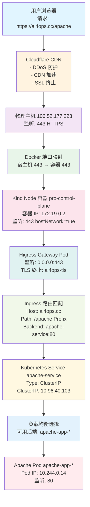
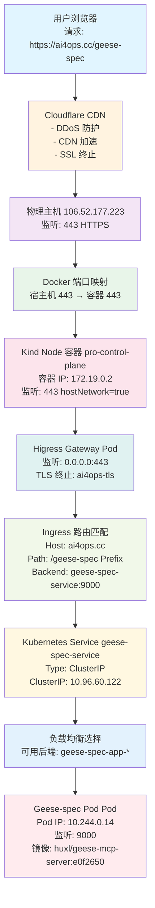
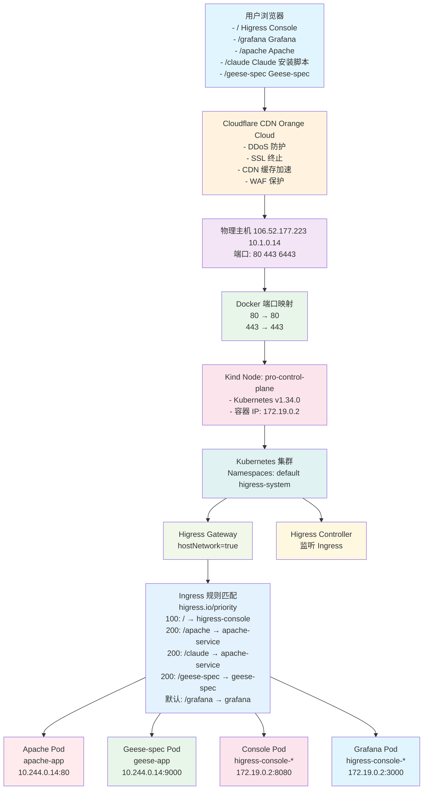

# 在新节点上部署 Higress 环境完整指南

本文档提供了从零开始在新节点上部署 Higress 环境的完整步骤，包括 Kind 集群、Let's Encrypt 证书管理和所有服务配置。

## 目录

- [前置条件](#前置条件)
- [Kind 集群创建](#kind-集群创建)
- [Higress 安装](#higress-安装)
- [Let's Encrypt 证书配置](#lets-encrypt-证书配置)
- [Apache 应用部署](#apache-应用部署)
- [Geese-spec 应用部署](#geese-spec-应用部署)
- [完整数据流图](#完整数据流图)
- [HTTPS 配置验证](#https-配置验证)
- [后续服务部署](#后续服务部署)
- [故障排查](#故障排查)
- [补充说明](#补充说明)

---

## 前置条件

### 系统要求

| 组件 | 最低版本 | 验证命令 |
|------|----------|----------|
| Docker | 20.10+ | `docker --version` |
| Kind | 0.17.0 | `kind --version` |
| kubectl | 与 Kind 兼容 | `kubectl version --client` |
| Helm | 3.8+ | `helm version` |
| curl | 任意版本 | `curl --version` |

### 网络要求

- 公网 IP（106.52.177.223）可访问
- 域名 `ai4ops.cc` DNS 解析到公网 IP
- 端口 80、443、6443 可用

### 验证命令

```bash
# 验证 Docker
docker --version

# 验证 Kind
kind --version

# 验证 kubectl
kubectl version --client

# 验证 Helm
helm version

# 验证网络连通性
curl -I http://ai4ops.cc
```

---

## 配置文件说明

以下配置文件用于部署 Higress 环境，每个文件的作用如下：

| 文件名 | 作用 | 命名空间 | 说明 |
|--------|------|----------|------|
| `kind.yaml` | Kind 集群配置 | - | 定义 Kind 集群结构、端口映射、镜像加速等 |
| `higress-console-ingress.yaml` | Higress 控制台 Ingress | `higress-system` | 提供 `/` 路径访问 Higress 控制台和内置 Grafana |
| `apache.yaml` | Apache 应用 + Claude 安装脚本 | `default` | 包含 Deployment、Service 和 3 个 Ingress（/apache, /claude） |
| `geese-spec-higress.yaml` | Geese-spec MCP 服务 | `default` | 部署 geese-spec 应用和 /geese-spec 访问入口 |
| `tls-secret.yaml` | TLS Secret 模板 | `higress-system` | 用于存储 Let's Encrypt 证书（需要通过 acme.sh 创建） |

**重要说明**：
- `higress-console-ingress.yaml` 配置的 path 是 `/`（Prefix），会捕获所有请求到 `ai4ops.cc`，包括 `/grafana`（Higress Console 内置路由）
- `apache.yaml` 和 `geese-spec-higress.yaml` 都引用 `ai4ops-tls` Secret（来自 `tls-secret.yaml`）以启用 HTTPS
- TLS 证书需要使用 acme.sh 手动创建，`tls-secret.yaml` 仅为模板文件

---

## Kind 集群创建

### kind.yaml 配置说明

Kind 集群使用配置文件 `kind.yaml`，关键配置项如下：

```yaml
kind: Cluster
apiVersion: kind.x-k8s.io/v1alpha4

# 镜像加速（可选，推荐使用）
containerdConfigPatches:
  - |-
    [plugins."io.containerd.grpc.v1.cri".registry.mirrors."docker.io"]
      endpoint = ["https://mirror.ccs.tencentyun.com"]

# Kubernetes 特性开关
featureGates:
  InPlacePodVerticalScaling: true
  UserNamespacesSupport: true
  InPlacePodVerticalScalingAllocatedStatus: true

nodes:
  - role: control-plane
    image: kindest/node:v1.34.0@sha256:7416a61b42b1662ca6ca89f02028ac133a309a2a30ba309614e8ec94d976dc5a

    # ===== 关键：端口映射配置 =====
    extraPortMappings:
      # 1. Kubernetes API Server (6443 → 6443)
      - containerPort: 6443
        hostPort: 6443
        listenAddress: 0.0.0.1  # 仅本地访问

      # 2. HTTP 流量 (80 → 80)
      - containerPort: 80
        hostPort: 80
        listenAddress: 0.0.0.0  # 监听所有网络接口

      # 3. HTTPS 流量 (443 → 443)
      - containerPort: 443
        hostPort: 443
        listenAddress: 0.0.0.0  # 监听所有网络接口

    # ===== API Server 配置 =====
    kubeadmConfigPatches:
      - |
        kind: ClusterConfiguration
        apiServer:
          certSANs:          # API Server 证书 SAN 配置
          - "106.52.177.223"   # 公网 IP
          - "10.1.0.14"         # 内网 IP
          - "localhost"
          - "127.0.0.1"
        kind: InitConfiguration
          nodeRegistration:
            kubeletExtraArgs:
              node-labels: "ingress-ready=true"
```

### extraPortMappings 工作原理

**端口映射关系**：
```
物理主机端口          Kind Node 容器端口
   80     ←→           80
   443    ←→           443
   6443   ←→           6443
```

**流量流程**：
1. 外部请求到达物理主机端口（80/443）
2. Docker 通过 `extraPortMappings` 将流量转发到 Kind 容器端口
3. 容器内的服务接收到请求并处理

**访问验证**：
```bash
# 跨节点访问测试
curl -I http://ai4ops.cc/
curl -k -I https://ai4ops.cc/
```

### 创建 Kind 集群

```bash
# 创建集群
kind create cluster --name pro --config kind.yaml

# 切换到 Kind 上下文
kubectl config use-context kind-pro

# 验证集群
kubectl cluster-info
kubectl get nodes
```

**预期输出**：
```
NAME                 STATUS   ROLES    AGE   VERSION
pro-control-plane    Ready    control-plane   2m    v1.34.0
```

### 访问 Kind 集群的两种方式

#### 方式 1：本地直接访问（推荐）

```bash
# 使用 kubectl 直接操作
kubectl get pods

# 从本地机器访问
curl http://localhost:80
```

#### 方式 2：远程访问（使用 kubeconfig 外部访问）

```bash
# 1. 创建用于外部访问的 kubeconfig
kubectl config view --raw --minify > /tmp/kind-config-external.yaml

# 2. 暴露 API Server（仅用于管理，不推荐公网访问）
# 修改 server 字段为公网 IP
# 注意：仅内网环境使用，公网环境不推荐

# 3. 使用外部 kubeconfig
kubectl --kubeconfig=/root/kind-cluster/kind-config-external.yaml get nodes
```

**当前环境信息**：
- 节点名称: `pro-control-plane`
- 上下文: `kind-pro`
- NodePorts: HTTP (32319), HTTPS (31842)

---

## Higress 安装

### 安装命令

```bash
# 添加 Higress Helm 仓库
helm repo add higress.io https://higress.cn/helm-charts

# 安装 Higress
helm install higress -n higress-system higress.io/higress \
  --create-namespace \
  --render-subchart-notes \
  --set global.local=true \
  --set global.o11y.enabled=true \
  --set higress-core.gateway.hostNetwork=true \
  --kube-context kind-pro
```

### 关键配置参数说明

| 参数 | 值 | 作用 |
|------|-----|------|
| `global.local=true` | true | 本地模式，不启用多集群特性 |
| `global.o11y.enabled=true` | true | 启用可观测性（Prometheus/Grafana/Loki） |
| `higress-core.gateway.hostNetwork=true` | true | **关键：Gateway 使用主机网络** |
| `--create-namespace` | - | 自动创建 namespace |

### hostNetwork=true 的作用

**对比**：

| 配置 | hostNetwork=false | hostNetwork=true |
|------|-----------------|------------------|
| Pod IP | 10.244.0.x (Pod 网络) | 172.19.0.2 (节点网络) |
| 监听地址 | 10.244.0.2:80 | 0.0.0.0:80 |
| 节点端口监听 | 无 | 有 |
| 流量路径 | 外部 → NodePort → Pod | 外部 → 节点端口 → Pod |

**当前配置**：`hostNetwork=true`，这是正确配置。

### 验证 Higress 安装

```bash
# 等待 Pod 就绪
kubectl wait --for=condition=ready pod -l app=higress-gateway -n higress-system --timeout=300s

# 检查 Pod 状态
kubectl get pods -n higress-system

# 检查 Service
kubectl get svc -n higress-system
```

**预期输出**：
```
NAME                          READY   STATUS    RESTARTS   AGE
higress-gateway-678f6895cb-cj7hk   2/2     Running   0          2m
higress-console-6899db4cc4-xm8fj      1/1     Running   1 (4d18h ago)   6d
...
```

---

## Let's Encrypt 证书配置

### 证书获取流程

Let's Encrypt 使用 DNS-01 挑战获取证书，流程如下：

```
1. acme.sh 向 Let's Encrypt 申请证书
   ↓
2. Let's Encrypt 要求验证域名所有权
   ↓
3. acme.sh 使用 Cloudflare API Token 自动添加 DNS TXT 记录：
   _acme-challenge.ai4ops.cc → <随机验证字符串>
   ↓
4. Let's Encrypt 解析该 TXT 记录进行验证
   ↓
5. 验证通过后，acme.sh 删除该 TXT 记录
   ↓
6. Let's Encrypt 签发证书
```

### Cloudflare API Token 用途

| 操作 | 需要 API Token | 原因 |
|------|-----------------|------|
| 添加 DNS TXT 记录 | ✅ | 创建 `_acme-challenge` 记录 |
| 删除 DNS TXT 记录 | ✅ | 验证后清理记录 |
| 获取证书 | ✅ | 自动化整个流程 |
| 证书续期 | ✅ | acme.sh 复用已保存的 Token |

### 安装 acme.sh

```bash
# 下载 acme.sh（单文件，轻量级）
curl https://get.acme.sh | sh

# 查看安装位置
which acme.sh
# 输出：/root/.acme.sh/acme.sh
```

**安装输出**：
```
[Sun Apr 5 10:46:03 AM CST 2026] Installing from online archive.
[Sun Apr 5 10:46:06 AM CST 2026] Downloading https://github.com/acmesh-official/acme.sh/archive/master.tar.gz
...
[Sun Apr 5 10:46:07 AM CST 2026] Installed to /root/.acme.sh/acme.sh
[Sun Apr 5 10:46:07 AM CST 2026] Installing alias to '/root/.bashrc'
[Sun Apr 5 10:46:07 AM CST 2026] Installing cron job
[Sun Apr 5 10:46:07 AM CST 2026] OK
```

### 配置 Cloudflare Token

```bash
# 设置环境变量（临时，仅当前会话有效）
export CF_Token="your_cloudflare_api_token_here"

# 永久保存（推荐）
echo "export CF_Token='your_cloudflare_api_token_here'" >> ~/.bashrc
source ~/.bashrc
```

**Token 权限要求**：
- Zone - DNS - Edit
- Zone - Zone - Read

### 获取 Let's Encrypt 证书

```bash
# 设置为 Let's Encrypt（默认为 ZeroSSL）
/root/.acme.sh/acme.sh --set-default-ca --server letsencrypt

# 获取证书（DNS-01 方式）
/root/.acme.sh/acme.sh --issue --dns dns_cf \
  -d ai4ops.cc \
  --email huxiaoliang.java@gmail.com
```

### Let's Encrypt DNS-01 挑战原理

#### 核心问题

**Let's Encrypt 如何证明你拥有域名控制权？**

```
┌─────────────────────────────────────────┐
│         Let's Encrypt              │
│     "证明 ai4ops.cc 属于你！"     │
└─────────────────────────────────────────┘
```

Let's Encrypt 需要验证后才会签发证书。

---

#### DNS-01 挑战流程

##### 第 1 步：申请证书

```
你 → acme.sh → Let's Encrypt
"我想为 ai4ops.cc 获取证书"
              ↓
Let's Encrypt: "好的，证明你拥有这个域名"
              ↓
Let's Encrypt 生成随机验证字符串: "5NrPg0HWCPJnrUU..."
```

##### 第 2 步：添加 DNS TXT 记录

```
acme.sh → Cloudflare API
"添加这个 TXT 记录"
              ↓
Cloudflare: 添加记录
域名: _acme-challenge.ai4ops.cc
类型: TXT
值:   "5NrPg0HWCPJnrUU..."
```

##### 第 3 步：Let's Encrypt 验证

```
Let's Encrypt
"等待 DNS 传播..."
"查询 TXT 记录..."
              ↓
Let's Encrypt 查询 DNS: _acme-challenge.ai4ops.cc
              ↓
如果值匹配 = "5NrPg0HWCPJnrUU..." → 验证成功！
如果值不匹配 = 验证失败...
```

##### 第 4 步：签发证书

```
Let's Encrypt
"验证通过，现在签发证书"
              ↓
返回证书和私钥文件
```

##### 第 5 步：删除 DNS TXT 记录

```
acme.sh → Cloudflare API
"清理临时记录"
              ↓
Cloudflare: 删除记录
域名: _acme-challenge.ai4ops.cc
```

---

#### 使用场景

##### 场景 1：本地 Kind 集群（你的当前环境）

| 特性 | HTTP-01 | DNS-01 |
|------|----------|---------|
| 需要 80 端口 | ✅ | ❌ |
| 公网 IP 可达 | ❌ | ✅ |
| 适用环境 | 有公网 IP | 内网/本地 |

**为什么使用 DNS-01？**
- Kind 集群在内网运行，没有公网 IP
- Cloudflare CDN 无法访问内网 80 端口
- DNS-01 只需要能控制域名 DNS 即可

**实际流程**：
```
acme.sh 使用 Cloudflare API Token
  ↓
添加 TXT 记录到 Cloudflare
  ↓
Let's Encrypt 验证
  ↓
获取证书
```

##### 场景 2：通配符域名

需求：为 `*.example.com` 获取证书

| 方式 | 说明 |
|------|------|
| HTTP-01 | 需要为每个子域创建 `/.well-known/acme-challenge/` 文件，无法一次性覆盖所有子域 |
| DNS-01 | 只需要在 `_acme-challenge.example.com` 添加一个 TXT 记录，通配符域名自动生效 |

##### 场景 3：无法开放 80 端口

某些环境：
- 公司内网
- 只允许 443 端口
- 防火墙限制

DNS-01 完美避开了 80 端口的需求

---

#### 为什么 acme.sh 能自动操作？

##### 关键：Cloudflare API Token

**重要注意事项**：
- 不要在此文档中包含敏感的 API Token
- 实际的 Token 由 acme.sh 保存在 `/root/.acme.sh/account.conf`
- 文档中的 `CF_Token="your_cloudflare_api_token_here"` 仅是示例格式
- Token 权限要求：Zone - DNS - Edit，Zone - Zone - Read

```bash
# 有 Token = 拥有 API 操作权限
CF_Token="your_cloudflare_api_token_here"
```

**acme.sh 使用 Token 的能力**：

| 操作 | 需要 Token | 用途 | 实际行为 |
|------|------------|------|----------|
| 添加 TXT 记录 | ✅ | acme.sh 通过 API 自动添加 |
| 删除 TXT 记录 | ✅ | acme.sh 通过 API 自动删除 |
| 查询记录状态 | ❌ | 不可操作（仅用于调试） |
| 获取证书 | ✅ | 自动化整个流程 |
| 证书续期 | ✅ | acme.sh 复用已保存的 Token |

---

#### 实际例子：你的环境

1. acme.sh 读取 CF_Token（从 account.conf）
2. acme.sh 向 Let's Encrypt 申请证书
3. Let's Encrypt 要求验证 ai4ops.cc
4. acme.sh 使用 Token 调用 Cloudflare API
5. Cloudflare 添加: `_acme-challenge.ai4ops.cc` TXT `"xxx"`
6. Let's Encrypt 查询 DNS，验证通过
7. Cloudflare 删除 TXT 记录
8. Let's Encrypt 签发证书
9. 证书保存到 `/root/.acme.sh/ai4ops.cc_ecc/`

---

##### 对比 HTTP-01 和 DNS-01

| 对比项 | HTTP-01 | DNS-01 |
|---|---|---|
| 验证方式 | Web 服务器文件 | DNS TXT 记录 |
| 验证位置 | 服务器 /.well-known/acme-challenge/ | DNS 服务器 |
| 防火墙需求 | 需要开放 80 端口 | 需要开放 53 端口 |
| 公网 IP 需求 | 需要公网 IP 可达 | 不需要公网 IP |
| 内网适用性 | 不适用内网 | 适用于内网 |
| 通配符证书 | 不支持 | 支持 |

##### 总结

DNS TXT 记录用于：
- **证明域名所有权**：只有能控制域名 DNS 的人才能添加/删除 TXT 记录
- **自动化验证**：acme.sh 通过 API Token 自动添加/删除 TXT 记录
- **无端口依赖**：不需要开放 80 端口
- **内网友好**：适用于没有公网 IP 的环境（如 Kind）

**关键**：Cloudflare API Token 提供了自动操作 DNS 的能力，让整个过程完全自动化。

##### 成功输出

```
[Sun Apr 5 10:47:50 AM CST 2026] Using CA: https://acme-v02.api.letsencrypt.org/directory
[Sun Apr 5 10:47:52 AM CST 2026] Registered
[Sun Apr 5 10:47:53 AM CST 2026] Creating domain key
[Sun Apr 5 10:47:53 AM CST 2026] The domain key is here: /root/.acme.sh/ai4ops.cc_ecc/ai4ops.cc.key
[Sun Apr 5 10:47:55 AM CST 2026] Adding TXT value: 5NrPg0HWCPJnrUU-eBq1c6Loui0QQ0zfRdZYFkGjtAg for domain: _acme-challenge.ai4ops.cc
[Sun Apr 5 10:47:58 AM CST 2026] The TXT record has been successfully added.
[Sun Apr 5 10:47:58 AM CST 2026] Let's check each DNS record now. Sleeping for 20 seconds first.
[Sun Apr 5 10:48:19 AM CST 2026] Success for domain ai4ops.cc '_acme-challenge.ai4ops.cc'.
[Sun Apr 5 10:48:32 AM CST 2026] Success
[Sun Apr 5 10:48:37 AM CST 2026] Removing DNS records.
[Sun Apr 5 10:48:40 AM CST 2026] Successfully removed
[Sun Apr 5 10:48:37 AM CST 2026] Verification finished, beginning signing.
[Sun Apr 5 10:48:40 AM CST 2026] Downloading cert.
[Sun Apr 5 10:48:41 AM CST 2026] Cert success.
[Sun Apr 5 10:48:41 AM CST 2026] Your cert is in: /root/.acme.sh/ai4ops.cc_ecc/ai4ops.cc.cer
```

### 证书文件位置

```
/root/.acme.sh/
├── ai4ops.cc/
│   ├── ai4ops.cc.cer          # 域名证书
│   ├── ai4ops.cc.key          # 私钥
│   ├── ca.cer                # 中间 CA 证书
│   └── fullchain.cer        # 完整证书链
└── ai4ops.cc_ecc/           # ECC 格式（本环境使用）
    ├── ai4ops.cc.cer
    ├── ai4ops.cc.key
    ├── ca.cer
    └── fullchain.cer
```

### 创建 Kubernetes TLS Secret

```bash
# 创建 TLS Secret
kubectl create secret tls ai4ops-tls \
  --cert=/root/.acme.sh/ai4ops.cc_ecc/fullchain.cer \
  --key=/root/.acme.sh/ai4ops.cc_ecc/ai4ops.cc.key \
  -n higress-system
```

### 验证 Secret

```bash
# 查看 Secret
kubectl get secret ai4ops-tls -n higress-system -o yaml

# 查看证书详情
kubectl get secret ai4ops-tls -n higress-system -o jsonpath='{.data.tls\.crt}' | \
  base64 -d | openssl x509 -noout -text -dates -subject
```

### 配置证书自动续期

```bash
# 查看 crontab 任务
crontab -l | grep acme

# 预期输出：
# 6 22 * * * "/root/.acme.sh"/acme.sh --cron --home "/root/.acme.sh" > /dev/null
```

**续期机制**：
- 每天 22:06 执行
- 自动检查证书是否需要续期（默认在过期前 60 天）
- 续期成功后自动更新 K8s Secret
- 不需要手动干预

**手动测试续期**：
```bash
# 强制续期（即使未到期）
/root/.acme.sh/acme.sh --renew -d ai4ops.cc --force

# 查看 acme.sh 续期日志
/root/.acme.sh/acme.sh --list
```

---

## Apache 应用部署

### 部署 Apache 应用

```bash
kubectl apply -f apache.yaml
```

### 验证部署

```bash
# 等待 Pod 就绪
kubectl wait --for=condition=available deployment/apache-app -n default --timeout=300s

# 检查 Pod
kubectl get pods -l app=apache

# 检查 Service
kubectl get svc apache-service
```

### 数据流图：浏览器 → ai4ops.cc → Apache Pod



---

## Geese-spec 应用部署

### 部署 Geese-spec 应用

```bash
kubectl apply -f geese-spec-higress.yaml
```

### 验证部署

```bash
# 等待 Pod 就绪
kubectl wait --for=condition=available deployment/geese-spec-app -n default --timeout=300s

# 检查 Pod
kubectl get pods -l app=geese-spec

# 检查 Service
kubectl get svc geese-spec-service
```

### 数据流图：浏览器 → ai4ops.cc → Geese-spec Pod



## 完整数据流图

### 所有服务访问路径




## HTTPS 配置验证

### Ingress TLS 配置

所有 Ingress 资源都已配置 TLS：

```yaml
spec:
  ingressClassName: higress
  tls:
  - hosts:
    - ai4ops.cc
    secretName: ai4ops-tls
  rules:
    - host: ai4ops.cc
      http:
        paths:
          - path: /...
```

### 为什么所有 Ingress 使用同一个 Secret？

**原因**：
1. 所有服务使用同一个域名 `ai4ops.cc`
2. Let's Encrypt 证书包含的 SAN：`DNS:ai4ops.cc`
3. 一个证书可以覆盖该域名下的所有路径
4. 简化管理：一个 Secret，一个续期任务

### 验证 HTTPS 配置

```bash
# 1. 验证 Secret 存在
kubectl get secret ai4ops-tls -n higress-system

# 2. 验证证书详情
kubectl get secret ai4ops-tls -n higress-system -o jsonpath='{.data.tls\.crt}' | \
  base64 -d | openssl x509 -noout -text -dates -subject

# 3. 验证 Ingress 配置
kubectl get ingress -A | grep -i "secretName: ai4ops-tls"

# 4. 本地测试 HTTPS
curl -k -I https://localhost/

# 5. 公网测试 HTTPS
curl -k -I https://ai4ops.cc/
curl -k -I https://ai4ops.cc/apache
curl -k -I https://ai4ops.cc/claude
curl -k -I https://ai4ops.cc/geese-spec
```

### 浏览器验证

访问以下 URL，确认 HTTPS 正常工作：

| 服务 | URL | 预期内容 |
|------|-----|----------|
| Higress Console | https://ai4ops.cc/ | Higress 管理界面 |
| Grafana | https://ai4ops.cc/grafana | Grafana 监控界面 |
| Apache | https://ai4ops.cc/apache | Apache 欢迎页 |
| Claude | https://ai4ops.cc/claude | Claude 安装脚本 |
| Geese-spec | https://ai4ops.cc/geese-spec | Geese Spec MCP 服务 |

**浏览器验证点**：
- ✅ 地址栏显示 🔒 锁图标
- ✅ 证书信息：`CN = ai4ops.cc`, `Issuer = Let's Encrypt`
- ✅ 有效期：90 天（Apr → Jul）

---

## 后续服务部署

### 部署新服务的步骤

1. **创建 Deployment YAML**

   ```yaml
   apiVersion: apps/v1
   kind: Deployment
   metadata:
     name: your-app
     namespace: default
   spec:
     replicas: 1
     selector:
       matchLabels:
         app: your-app
     template:
       metadata:
         labels:
           app: your-app
       spec:
         containers:
         - name: your-app
           image: your-image:tag
           ports:
           - containerPort: 8080
   ```

2. **创建 Service YAML**

   ```yaml
   apiVersion: v1
   kind: Service
   metadata:
     name: your-service
     namespace: default
   spec:
       type: ClusterIP
       ports:
       - port: 8080
         targetPort: 8080
       selector:
         app: your-app
   ```

3. **创建 Ingress YAML（含 TLS）**

   ```yaml
   apiVersion: networking.k8s.io/v1
   kind: Ingress
   metadata:
     name: your-ingress
     namespace: default
     annotations:
       kubernetes.io/ingress.class: higress
       higress.io/priority: "200"
   spec:
     ingressClassName: higress
     tls:
       - hosts:
         - ai4ops.cc
       secretName: ai4ops-tls
     rules:
       - host: ai4ops.cc
         http:
           paths:
             - path: /your-path
               pathType: Prefix
               backend:
                 service:
                   name: your-service
                   port:
                     number: 8080
   ```

4. **应用配置**

   ```bash
   kubectl apply -f your-deployment.yaml
   kubectl apply -f your-service.yaml
   kubectl apply -f your-ingress.yaml
   ```

### 添加新域名的步骤

如果需要为不同域名添加 HTTPS 服务：

1. **获取多域名证书**

   ```bash
   /root/.acme.sh/acme.sh --issue --dns dns_cf \
     -d ai4ops.cc \
     -d admin.ai4ops.cc \
     -d api.ai4ops.cc \
     --email huxiaoliang.java@gmail.com
   ```

2. **为新域名创建 TLS Secret**

   ```bash
   kubectl create secret tls admin-ai4ops-tls \
     --cert=/root/.acme.sh/admin.ai4ops.cc_ecc/fullchain.cer \
     --key=/root/.acme.sh/admin.ai4ops.cc_ecc/admin.ai4ops.cc.key \
     -n higress-system
   ```

3. **使用新 Secret 创建 Ingress**

   ```yaml
   spec:
     tls:
       - hosts:
         - admin.ai4ops.cc
       secretName: admin-ai4ops-tls
     rules:
       - host: admin.ai4ops.cc
         ...
   ```

---

## 故障排查

### 问题 1: 证书续期失败

**症状**：证书到期或无法自动续期

**排查步骤**：
```bash
# 1. 检查 crontab 任务
crontab -l | grep acme

# 2. 手动测试续期
/root/.acme.sh/acme.sh --cron --home /root/.acme.sh --debug

# 3. 查看 acme.sh 配置
/root/.acme.sh/acme.sh --list

# 4. 验证 Cloudflare Token
export CF_Token="your_token"
/root/.acme.sh/acme.sh --issue --dns dns_cf -d ai4ops.cc --test
```

### 问题 2: HTTPS 访问失败（522 错误）

**症状**：Cloudflare 返回 522 Error

**原因**：Cloudflare 无法连接到源服务器

**排查步骤**：
```bash
# 1. 检查端口监听
netstat -tlnp | grep ":443 "

# 2. 测试本地访问
curl -k -I https://localhost/

# 3. 测试容器内访问
docker exec pro-control-plane curl -k -I https://localhost/

# 4. 检查 Higress Gateway 状态
kubectl get pod -n higress-system -l app=higress-gateway

# 5. 查看 Gateway 日志
kubectl logs -n higress-system deploy/higress-gateway -c higress-gateway --tail=50
```

### 问题 3: HTTP 重定向不生效

**症状**：访问 http:// 自动不跳转到 https://

**原因**：Higress 默认不自动重定向

**解决方案**：在 Higress Console 配置中启用强制 HTTPS

### 问题 4: Ingress 路由优先级冲突

**症状**：访问路径返回错误的服务

**排查步骤**：
```bash
# 1. 查看所有 Ingress 优先级
kubectl get ingress -A -o yaml | grep -A 2 "priority"

# 2. 查看路由匹配顺序
kubectl logs -n higress-system deploy/higress-gateway -c higress-gateway | grep -i "route"

# 3. 调整优先级
kubectl patch ingress your-ingress -n default --type=json -p='[
  {"op": "replace", "path": "/metadata/annotations/higress.io~1priority", "value": "150"}
]'
```

**优先级规则**：
- 数字越大，优先级越高
- `/` 路径（Higress Console）建议优先级 100
- 其他路径建议优先级 50-200
- 默认路由优先级最低

---

## 补充说明

### 路由优先级配置

当前环境的路由优先级：

| Ingress | 路径 | 优先级 | 说明 |
|---------|------|--------|------|
| higress-console-ingress | `/` | 100 | 最高优先级，处理根路径和静态资源 |
| apache-ingress | `/apache` | 200 | 处理 Apache 相关请求 |
| claude-ingress | `/claude` | 200 | 处理 Claude 安装脚本 |
| geese-spec-ingress | `/geese-spec` | 200 | 处理 Geese Spec 服务 |
| higress-grafana-ingress | `/grafana` | 默认 | Grafana 监控 |

**优先级匹配规则**：
1. Higress Controller 按优先级排序路由
2. 精确匹配的优先级生效
3. 前缀匹配：`/apache` 会匹配 `/apache/*`
4. 精确匹配：`/claude` 使用 `Exact` 类型

### 资源限制配置

当前环境的资源配置：

| 服务 | CPU Request | Memory Request | CPU Limit | Memory Limit |
|------|------------|---------------|-----------|--------------|
| Apache | 50m | 32Mi | 100m | 128Mi |
| Geese-spec | 100m | 128Mi | 100m | 128Mi |

**配置原则**：
- requests: 生产环境的 50%
- limits: 生产环境的 100%
- 根据 Pod 用途调整（前端 vs 后端）

### Higress 可观测性

Higress 内置了 Prometheus、Grafana、Loki：

| 组件 | 用途 | 访问路径 |
|------|------|----------|
| Prometheus | 指标采集 | 内部 API |
| Grafana | 可视化 | /grafana |
| Loki | 日志聚合 | 内部 API |

**启用命令**：
```bash
helm install higress ... --set global.o11y.enabled=true
```

### 证书有效期监控

Let's Encrypt 证书有效期为 90 天，续期策略如下：

| 剩余天数 | 行为 | 说明 |
|----------|----------|----------|
| > 60 | 不操作 | 正常运行中 |
| ≤ 60 | 续期 | acme.sh 自动续期 |
| ≤ 7 | 强制续期 | 紧急续期 |
| 0 | 过期 | 需要手动续期 |

### 环境变量配置

```bash
# Cloudflare Token（证书管理用）
export CF_Token="your_cloudflare_token"

# kubectl 上下文
export KUBECONFIG="/root/.kube/config"

# Kind 上下文
export KUBECONFIG="kind-pro"
```

### 参考链接

- [Higress 官方文档](https://higress.cn/)
- [acme.sh GitHub](https://github.com/acmesh-official/acme.sh)
- [Let's Encrypt 文档](https://letsencrypt.org/docs/)
- [Kind 官方文档](https://kind.sigs.k8s.io/)
- [Cloudflare API 文档](https://developers.cloudflare.com/api/)
