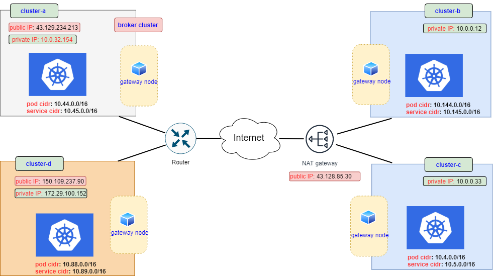

## Case result

|     broker k8s     |         mannaged k8s          |                     pod/pod connectivity                     |                        service discovery                         |         CNI version       |  deployment mode | kube-proxy mode |        note       |
|   -------------    |         -------------         |                         -------------                        |                          -------------                           |        -------------      |   -------------  |  -------------  |    -------------  |
|      1.15.7        |            1.15.7             | ok (pod cidr: (borker)10.44.0.0/16; (mannaged)10.144.0.0/16) | ok (service cidr: (borker)10.45.0.0/16; (mannaged)10.145.0.0/16) |       flannel v0.14.0     |    On-Premise    |    iptables     | subctl v0.6.0-dev |
|      1.16.7        |            1.16.7             | ok (pod cidr: (borker)10.44.0.0/16; (mannaged)10.144.0.0/16) | ok (service cidr: (borker)10.45.0.0/16; (mannaged)10.145.0.0/16) |      calicoctl v3.18.4    |    On-Premise    |    iptables     | subctl v0.9.0-dev |
|      1.19.1        |            1.19.1             | ok (pod cidr: (borker)10.44.0.0/16; (mannaged)10.144.0.0/16) | ok (service cidr: (borker)10.45.0.0/16; (mannaged)10.145.0.0/16) |      calicoctl v3.18.4    |    On-Premise    |      ipvs       | subctl v0.9.0 |
|      1.19.1        |            1.19.1             | ok (pod cidr: (borker)10.44.0.0/16; (mannaged)10.144.0.0/16) | ok (service cidr: (borker)10.45.0.0/16; (mannaged)10.145.0.0/16) |      calicoctl v3.18.4    |    On-Premise    |    iptables     | subctl v0.9.0 |
|      1.19.7        |            1.19.7             | ok (pod cidr: (borker)10.44.0.0/16; (mannaged)10.88.0.0/16)  | ok (service cidr: (borker)10.45.0.0/16; (mannaged)10.89.0.0/16   |       flannel v0.14.0     |    On-Premise    |    iptables     | subctl v0.9.0 |
| TKE 独立集群1.18.4 |       TKE 独立集群1.18.4      | ok (pod cidr: (borker)10.1.1.0/24;  (mannaged)10.0.1.0/24)   | ok (service cidr: (borker)10.55.0.0/24; (mannaged)10.155.0.0/24) |           VPC-CNI         |       Cloud      |      ipvs       | subctl v0.9.0 |
| TKE 独立集群1.18.4 |       TKE 独立集群1.18.4      | ok (pod cidr: (borker)10.0.0.0/24;  (mannaged)10.0.1.0/24)   | ok (service cidr: (borker)10.45.0.0/24; (mannaged)10.145.0.0/24) |           VPC-CNI         |       Cloud      |    iptables     | subctl v0.9.0 |
| TKE 独立集群1.18.4 |  GKE 独立集群1.19.10-gke.1600 | ok (pod cidr: (borker)10.0.0.0/24;  (mannaged)10.4.0.0/14)   | ok (service cidr: (borker)10.45.0.0/24; (mannaged)10.8.0.0/20)   | VPC-CNI; VPC-native traffic routing | Cloud  |    iptables     | subctl v0.9.0 |
| TKE 独立集群1.18.4 |   AKS 独立集群1.18.8-aliyun   | ok (pod cidr: (borker)10.0.0.0/24;  (mannaged)10.194.0.0/16  | ok (service cidr: (borker)10.45.0.0/24; (mannaged)172.16.0.0/16  |      VPC-CNI; flannel     |       Cloud      |    iptables     | (borker)subctl v0.9.0; (mannaged)v0.9.1 |
| TKE 独立集群1.18.4 |  GKE 独立集群1.19.9-gke.1900  | ok (pod cidr: (borker)10.44.0.128/26;(mannaged)10.56.0.0/14  | ok (service cidr: (borker)10.44.0.192/26;(mannaged)10.60.0.0/20  |Global Router; VPC-native traffic routing |Cloud|  iptables     | subctl v0.9.1 |
| TKE 独立集群1.18.4 |   AKS 独立集群1.18.8-aliyun   | ok (pod cidr: (borker)10.44.0.128/26;(mannaged)10.67.0.0/16  | ok (service cidr: (borker)10.44.0.192/26;(mannaged)172.16.0.0/16 | Global Router; flannel    |       Cloud      |    iptables     | subctl v0.9.1 |
| TKE 托管集群1.18.4 |       TKE 托管集群1.18.4      | ok (pod cidr: (borker)10.1.1.0/24; (mannaged)172.29.100.0/24)| ok (service cidr: (borker)10.99.0.0/24; (mannaged)10.199.0.0/24  |           VPC-CNI         |       Cloud      |    iptables     | subctl v0.9.0 |

 

Topology figure are shown as following
 

 

### globalnet controller

|     broker k8s     |         mannaged k8s          |                     pod/pod connectivity                     |                        service discovery                         |                          Globalnet-CIDR                          |         CNI version       |  deployment mode | kube-proxy mode |        note        |
|   -------------    |         -------------         |                         -------------                        |                          -------------                           |                          -------------                           |        -------------      |   -------------  |  -------------  |    -------------   |
|      1.19.1        |            1.19.1             | not supported (pod cidr(broker and mannaged): 10.44.0.0/16)  |       ok (service cidr: (borker and mannaged)10.45.0.0/16)       |      (borker)242.254.144.0/24; (mannaged)242.254.145.0/24        |       flannel v0.14.0     |    On-Premise    |    iptables     | subctl v0.10.0-rc0 |

 

Topology figure are shown as following
 

 

### submariner NAT traversal case (1)
If you need to transfer files to computers without public IP, 
you can create a new one with public IP. They are in the same intranet
 

|    cluster-name    |           role           |        ip address        |         pod cidr         |        service cidr        |         CNI version       |  deployment mode  | kube-proxy mode |        note        |
|   -------------    |      -------------       |      -------------       |       -------------      |        -------------       |        -------------      |   -------------   |  -------------  |    -------------   |
|     cluster-a      |   broker k8s (v1.19.7)   |      43.129.234.213      |       10.44.0.0/16       |        10.45.0.0/16        |       flannel v0.14.0     |    On-Premise     |    iptables     |    subctl v0.9.0   |
|     cluster-c      |  mannaged k8s(v1.19.7)   |     NAT(43.128.85.30)    |       10.4.0.0/16        |         10.5.0.0/16        |       flannel v0.14.0     |    On-Premise     |    iptables     |    subctl v0.9.0   |
|     cluster-d      |  mannaged k8s(v1.19.7)   |      150.109.237.90      |       10.88.0.0/16       |        10.89.0.0/16        |       flannel v0.14.0     |    On-Premise     |    iptables     |    subctl v0.9.0   |

 

|    cluster-name    |         cluster-a         |        cluster-c         |         cluster-d         |
|   -------------    |       -------------       |      -------------       |       -------------       |
|     cluster-a      |             Y             |            Y             |             Y             |
|     cluster-c      |             Y             |            Y             |             Y             |
|     cluster-d      |             Y             |            Y             |             Y             |

 

Topology figure are shown as following
 

 

### submariner NAT traversal case (2)
prot mapping are neeeded in this case 
 

|    cluster-name    |           role           |        ip address        |         pod cidr         |        service cidr        |         CNI version       |  deployment mode  | kube-proxy mode |        note        |
|   -------------    |      -------------       |      -------------       |       -------------      |        -------------       |        -------------      |   -------------   |  -------------  |    -------------   |
|     cluster-a      |   broker k8s (v1.19.7)   |      43.129.234.213      |       10.44.0.0/16       |        10.45.0.0/16        |       flannel v0.14.0     |    On-Premise     |    iptables     |    subctl v0.9.1   |
|     cluster-b      |  mannaged k8s(v1.19.7)   |     NAT(43.128.85.30)    |       10.144.0.0/16      |        10.145.0.0/16       |       flannel v0.14.0     |    On-Premise     |    iptables     |    subctl v0.9.1   |
|     cluster-c      |  mannaged k8s(v1.19.7)   |     NAT(43.128.85.30)    |       10.4.0.0/16        |         10.5.0.0/16        |       flannel v0.14.0     |    On-Premise     |    iptables     |    subctl v0.9.1   |
|     cluster-d      |  mannaged k8s(v1.19.7)   |      150.109.237.90      |       10.88.0.0/16       |        10.89.0.0/16        |       flannel v0.14.0     |    On-Premise     |    iptables     |    subctl v0.9.1   |

 

|    cluster-name    |         cluster-a         |        cluster-b         |        cluster-c         |         cluster-d         |
|   -------------    |       -------------       |      -------------       |      -------------       |       -------------       |
|     cluster-a      |             Y             |            Y             |            Y             |             Y             |
|     cluster-b      |             Y             |            Y             |            Y             |             Y             |
|     cluster-c      |             Y             |            Y             |            Y             |             Y             |
|     cluster-d      |             Y             |            Y             |            Y             |             Y             |

 

Topology figure are shown as following
 

 

## Issue list

1. for a cluster with multi nodes, it would be better to cordon other nodes (gateway election)
2. 8080 conflict (The port are needed both in TKE and the pod submariner-gateway)
3. todo
	 
	(3.1) cluster-a(public ip A), cluster-b(NAT B), cluster-c(NAT C), cluster-d(public ip D)
4. reference links
	 
	(4.1)https://github.com/submariner-io/submariner/issues/1492
	 
	(4.2)https://github.com/submariner-io/submariner/issues/1380
	 
	(4.3)https://github.com/submariner-io/submariner/issues/1374
	 
	(4.4)https://github.com/submariner-io/submariner/issues/1372